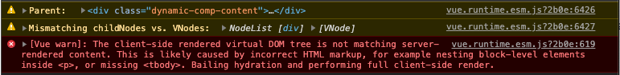
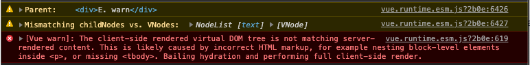

# Vue SSR dynamic component `v-html` bug

This repository reproduces a Vue SSR bug when using `v-html` on a component that has a root [dynamic-component](https://vuejs.org/v2/guide/components.html#Dynamic-Components) (eg. `<component />`).

## Simple example

_Dynamic.vue_
```vue
<template>
  <component is="div">
    content necessary
  </component>
</template>

```

_App.vue_
```vue
<template>
  <dynamic v-html="'<div>hydration warning</div>'" />
</template>

```


## Reproduction
_This reproduction uses NUXT, but is reproducible outside of NUXT_

1. Clone repo
2. Install deps `npm ci`
3. `npm run dev` to start SSR NUXT server
4. Visting landing page and view Dev console

 
## Results

### D

#### Vue code
```vue
<dynamic-comp-content v-html="'<div>D. warn</div>'" />
```

#### Warning


#### SSR output
```html
<div><div class="dynamic-comp-content"><div>D. warn</div></div></div>
```

#### Client output
```html
<div><div class="dynamic-comp-content"><div>D. warn</div></div></div>
```

### E

#### Vue code
```vue
<dynamic-comp-wrapped v-html="'E. warn'" />
```

#### Warning


#### SSR output
```html
<div><div>E. warn</div></div>
````

#### Client output
```html
<div><div>E. warn</div></div>
```


